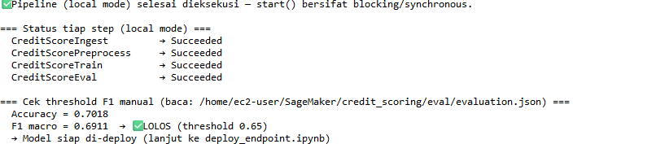
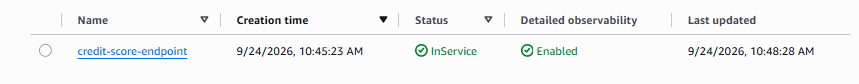
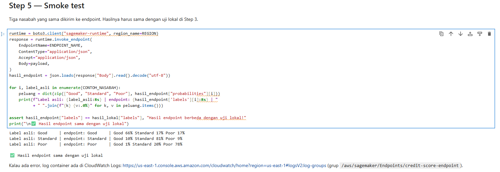
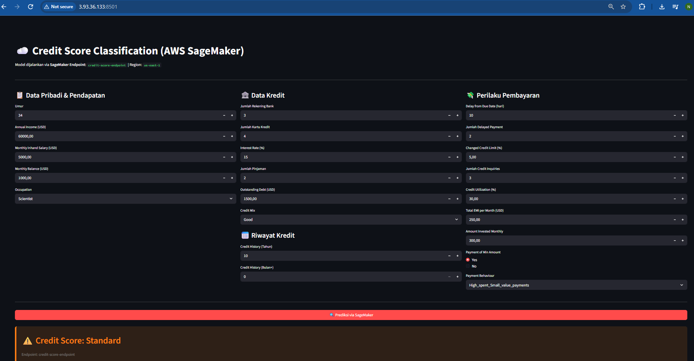
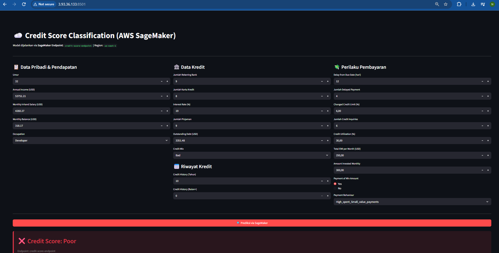
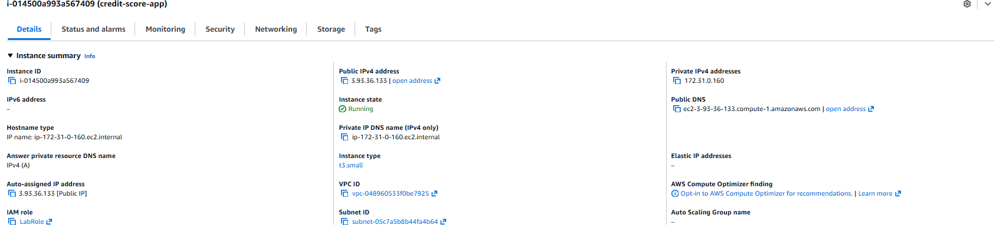

# Credit Score Classification

Proyek akhir mata kuliah **Model Deployment** (DTSC6012001), BINUS University.

Model yang menggolongkan skor kredit nasabah menjadi **Good**, **Standard**, atau **Poor**, beserta seluruh jalur dari data mentah sampai model yang bisa dipakai: pipeline pelatihan, pencatatan eksperimen dengan MLflow, aplikasi prediksi Streamlit, dan deployment ke AWS SageMaker.

## Hasil

| Model | F1 macro (validasi silang per nasabah, setelah GridSearchCV) |
|---|---|
| Logistic Regression | 0,640 |
| Decision Tree | 0,656 |
| Gradient Boosting | 0,653 |
| **Random Forest** | **0,669** |

Random Forest terpilih, lalu diuji sekali pada data uji yang tidak pernah dilihat selama pelatihan:

| Metrik (data uji) | Random Forest | Patokan: selalu menebak kelas terbanyak |
|---|---|---|
| F1 macro | **0,689** | 0,230 |
| Accuracy | 0,693 | 0,528 |
| Recall macro | 0,737 | 0,333 |

F1 macro dipakai sebagai metrik utama karena kelasnya tidak seimbang (Standard 53%, Poor 29%, Good 18%). Accuracy saja bisa menyesatkan: menebak "Standard" untuk semua nasabah sudah memberi accuracy 53%.

## Keputusan penting

**Data dibagi per nasabah, bukan per baris.** Dataset berisi 25.000 baris, tetapi hanya dari 11.254 nasabah, karena satu nasabah dicatat setiap bulan. Kalau dibagi acak per baris, sekitar 80% baris di data uji milik nasabah yang juga ada di data latih, sehingga model dinilai pada orang yang sudah pernah dilihatnya. Karena itu pembagian data memakai `GroupShuffleSplit` dan validasi silang memakai `StratifiedGroupKFold`, keduanya berdasarkan `Customer_ID`. Dengan model dan pembersihan yang sama, validasi acak per baris memberi F1 macro 0,686, sedangkan validasi per nasabah 0,669. Selisihnya kecil, jadi model tidak sekadar menghafal nasabah, tetapi skor per nasabah itu yang jujur.

**Nilai salah input dianggap tidak diketahui, bukan dipotong.** Data berisi umur 4824, jumlah pinjaman -100, dan suku bunga 1663%. Nilai seperti ini diganti NaN lalu diisi median, alih-alih dipotong ke batas wajar. Kalau dipotong ke 90, muncul 473 nasabah yang tiba-tiba berumur tepat 90 tahun, padahal umur aslinya tidak diketahui. Skor model untuk kedua cara hampir sama (0,689 dan 0,690), jadi alasannya bukan skor, melainkan supaya data yang dipakai model tetap jujur. Batas wajar tiap kolom diambil dari celah di data: misalnya suku bunga asli ada di 1–34%, tidak ada nilai 35–72%, dan nilai rusak mulai dari 73%.

**Pembersihan data yang sama dipakai saat pelatihan dan prediksi.** Aplikasi Streamlit memanggil fungsi `clean()` yang sama dengan pipeline pelatihan, dan model disimpan sebagai satu `sklearn.Pipeline` (imputasi, scaling, one-hot encoding, lalu classifier). Dengan begitu tidak ada perbedaan perlakuan data antara pelatihan dan pemakaian.

## Isi repo

```
Soal1a_Notebook_EDA/
  credit_score_EDA.ipynb     eksplorasi data, pembersihan, dan perbandingan model
  data_C.csv                 dataset (25.000 baris, 28 kolom)

Soal1bc_Local_Pipeline/credit_scoring/local/
  pipeline.py                menjalankan seluruh tahap berurutan
  data_ingestion.py          1. memuat dan memvalidasi CSV
  preprocessing.py           2. membersihkan data dan membagi per nasabah
  train.py                   3. GridSearchCV untuk 4 model, setiap percobaan dicatat di MLflow
  evaluation.py              4. menguji model terbaik pada data uji
  inferencing.py             fungsi prediksi untuk satu nasabah
  app.py                     aplikasi Streamlit

Soal2_AWS_Pipeline/
  pipeline_aws.py            SageMaker Pipelines: ingestion, preprocessing, training, evaluation
  *_aws.py                   skrip untuk tiap tahap di container SageMaker
  inference_aws.py           handler model untuk SageMaker Endpoint
  deploy_endpoint.ipynb      mengunggah model ke S3 dan membuat endpoint
  app_aws.py                 aplikasi Streamlit yang memanggil endpoint

docs/screenshots/            bukti deployment di AWS
```

Pipeline lokal ditutup dengan *deployment gate*: model hanya disetujui kalau F1 macro pada data uji minimal 0,65.

## Deployment di AWS

Versi AWS memakai pembersihan data, pembagian per nasabah, dan grid hyperparameter yang sama dengan versi lokal. Seluruh alurnya dijalankan di AWS Academy Learner Lab:

**1. SageMaker Pipelines.** Empat tahap (ingest, preprocess, train, evaluate) dijalankan dalam local mode di notebook instance, dan semuanya berhasil. Random Forest kembali terpilih. Di data uji, F1 macro 0,691 dan accuracy 0,702, lolos ambang 0,65. Angkanya sedikit berbeda dari versi lokal (0,689) karena container SageMaker memakai scikit-learn 1.4.2.



Di local mode, SDK SageMaker tidak menyalin hasil tiap tahap ke folder tujuan. Karena itu `pipeline_aws.py` menjalankan ulang skrip yang sama langsung di notebook instance, dan file model yang di-deploy diambil dari hasil itu.

**2. SageMaker Endpoint.** Model dikemas, diunggah ke S3, lalu di-deploy di instance `ml.m5.large`. Smoke test mengirim tiga nasabah dari data uji (Good, Standard, Poor). Ketiganya ditebak benar, dan hasilnya sama dengan uji fungsi endpoint di notebook sebelum deploy.





**3. Aplikasi Streamlit di EC2.** `app_aws.py` dijalankan di instance EC2 `t3.small` dengan IAM role yang boleh memanggil endpoint. Form dikirim ke endpoint lewat boto3, dan hasilnya ditampilkan di halaman yang dibuka dari IP publik instance.







Setelah pengujian selesai, instance EC2 di-terminate dan endpoint dihapus supaya tidak terus menimbulkan biaya. Karena itu `app_aws.py` tidak bisa dicoba tanpa membuat endpoint baru dengan `deploy_endpoint.ipynb`.

## Menjalankan secara lokal

```
cd Soal1bc_Local_Pipeline/credit_scoring/local
python -m venv venv
venv\Scripts\activate
pip install -r requirements.txt

python pipeline.py        # melatih dan menguji model
streamlit run app.py      # membuka aplikasi prediksi
mlflow ui --backend-store-uri sqlite:///mlflow.db   # melihat seluruh percobaan
```

File model (`artifacts/best_model.pkl`, sekitar 64 MB) tidak disimpan di repo karena ukurannya. File itu dibuat oleh `python pipeline.py`.

## Data

Dataset C yang diberikan untuk tugas ini, berasal dari dataset publik *Credit Score Classification* di Kaggle. Berisi data keuangan dan perilaku pembayaran nasabah per bulan, dengan banyak nilai kotor dan salah input.
